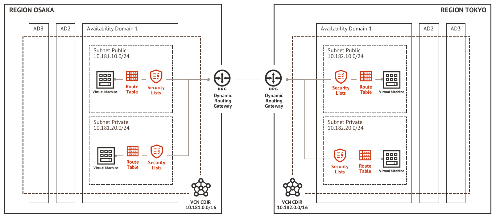

<div style="font-style: italic; text-align: center;" markdown="1">

# Remote VCN Peering
##### Os endereçamentos e nomes, são apenas exemplos para facilitar o entendimento.

</div>

|  | 
|:--:| 
| *Diagrama de rede* |

> **Pré-requisitos:**
>- Ter um [ambiente cloud](https://www.oracle.com/br/cloud/free) funcional no **OCI**;
>- Estar inscrito em duas ou mais **[região do OCI](https://docs.oracle.com/en-us/iaas/Content/General/Concepts/regions.htm)**;
>- Uma VCN criada em **cada região** com **[CIDRs](https://en.wikipedia.org/wiki/Classless_Inter-Domain_Routing) diferentes**;
>- As duas VCNs não podem ter **endereçamentos conflitantes**;
>- [OCI CLI instalado](https://docs.oracle.com/en-us/iaas/Content/API/SDKDocs/cliinstall.htm) e [configurado](https://docs.oracle.com/en-us/iaas/Content/API/SDKDocs/cliinstall.htm#configfile) para acesso as duas regiões do OCI.


### 1. O primeiro item que vamos precisar para seguir em frente eh o *ocid* do *compartment* onde todos os elementos e recursos serao criados. Para tanto podemos utilizar o comando abaixo para consultar os *compartments* criados e ir navegando em cada um utilizando o paramentro "*--compartment-id*" e encontrar o *compartment* desejado.

- **Exite os compartments no *compartment* root:**
  ```
  oci iam compartment list \
  --raw-output \
  --query "data[*].[id,name]"
  ```
  
- **Exite os *compartments* de dentro do **ocid** especificado:**
  ```
  oci iam compartment list \
  --compartment-id "ocid1.compartment.oc1..<substitua_pelo_seu_ocid>" \
  --raw-output \
  --query "data[*].[id,name]"
  ```

Depois de encontrar o **ocid** do *compartment* que sera usado para o *deploy* de todos os elementos e recursos que serao criados, defina as variavel **COMPARTMENT_NETWORK** conforme abaixo:
```
COMPARTMENT_NETWORK='ocid1.compartment.oc1..<substitua_pelo_seu_ocid>'
```

### 2. Criar o DRG (*Dynamic Routing Gateways*) para cada VCN (*Virtual Cloud Networks*):

- Executar na regiao: Osaka
  ```
  OSAKA_DRG=$(oci network drg create \
  --wait-for-state "AVAILABLE" \
  --compartment-id ${COMPARTMENT_NETWORK} \
  --display-name drg-osaka \
  --raw-output \
  --query "data.id")
  echo ${OSAKA_DRG}
  ```
- Executar na regiao: Tokyo
  ```
  TOKYO_DRG=$(oci network drg create \
  --wait-for-state "AVAILABLE" \
  --compartment-id ${COMPARTMENT_NETWORK} \
  --display-name drg-tokyo \
  --raw-output \
  --query "data.id")
  echo ${TOKYO_DRG}
  ```

### 3. Criar *attachment* do DRG a VCN:

- Executar na regiao: Osaka
  ```
  OSAKA_VCN_ID=$(oci network vcn list \
  --lifecycle-state "AVAILABLE" \
  --compartment-id ${COMPARTMENT_NETWORK} \
  --raw-output \
  --query "data[?contains(\"display-name\", 'vcn_ap-osaka-1')].id|[0]")
  echo ${OSAKA_VCN_ID}

  OSAKA_CIDR=$(oci network vcn get \
  --vcn-id ${OSAKA_VCN_ID} \
  --raw-output \
  --query 'data."cidr-block"')
  
  # -----------------------------------------------------
  # Executar o resultado da linha abaixo na console onde
  # esta sendo aplicado os comandos da reginao de TOKYO:
  echo "OSAKA_CIDR=${OSAKA_CIDR}"

  oci network drg-attachment create \
  --wait-for-state "ATTACHED" \
  --drg-id ${OSAKA_DRG} \
  --vcn-id ${OSAKA_VCN_ID}
  ```

- Executar na regiao: Tokyo
  ```
  TOKYO_VCN_ID=$(oci network vcn list \
  --lifecycle-state "AVAILABLE" \
  --compartment-id ${COMPARTMENT_NETWORK} \
  --raw-output \
  --query "data[?contains(\"display-name\", 'vcn_ap-tokyo-1')].id|[0]")
  echo ${TOKYO_VCN_ID}

  TOKYO_CIDR=$(oci network vcn get \
  --vcn-id ${OSAKA_VCN_ID} \
  --raw-output \
  --query 'data."cidr-block"')
  
  # -----------------------------------------------------
  # Executar o resultado da linha abaixo na console onde
  # esta sendo aplicado os comandos da reginao de OSAKA:
  echo "TOKYO_CIDR=${TOKYO_CIDR}"

  oci network drg-attachment create \
  --wait-for-state "ATTACHED" \
  --drg-id ${TOKYO_DRG} \
  --vcn-id ${TOKYO_VCN_ID}
  ```

### 4. Criar o RPC (*Remote Peering Connection*)

- Executar na regiao: Osaka
  ```
  OSAKA_RPC=$(oci network remote-peering-connection create \
  --compartment-id ${COMPARTMENT_NETWORK} \
  --wait-for-state "AVAILABLE" \
  --drg-id ${OSAKA_DRG} \
  --raw-output \
  --query "data.id")
  echo "OSAKA_RPC=${OSAKA_RPC}"
  ```

- Executar na regiao: Tokyo
  ```
  TOKYO_RPC=$(oci network remote-peering-connection create \
  --compartment-id ${COMPARTMENT_NETWORK} \
  --wait-for-state "AVAILABLE" \
  --drg-id ${TOKYO_DRG} \
  --raw-output \
  --query "data.id")
  echo "TOKYO_RPC=${TOKYO_RPC}"
  ```

### 5. Estabeleca a conexao entre os dois RPCs:

- Executar na regiao: Osaka
  ```
  oci network remote-peering-connection connect \
  --peer-id ${TOKYO_RPC} \
  --peer-region-name "ap-tokyo-1" \
  --remote-peering-connection-id ${OSAKA_RPC}
  ```


### 6. Criando as rotas:

- Executar na regiao: Osaka
  ```
  OSAKA_DEFAULT_RT_ID=$(oci network route-table list  \
  --lifecycle-state "AVAILABLE" \
  --compartment-id ${COMPARTMENT_NETWORK} \
  --raw-output \
  --query "data[?contains(\"display-name\", 'Default Route Table for')].id|[0]")

  JSON_RULES_TO_ADD=$(mktemp)

  oci network route-table list \
  --lifecycle-state "AVAILABLE" \
  --raw-output \
  --compartment-id ${COMPARTMENT_NETWORK} \
  --query "data[?contains(\"display-name\", 'Default Route Table for')].\"route-rules\"|[0]" >${JSON_RULES_TO_ADD}

  jq ". + [{\"cidrBlock\": \"${TOKYO_CIDR}\",\"networkEntityId\": \"${OSAKA_DRG}\"}]" ${JSON_RULES_TO_ADD} >/tmp/tmp_123
  mv /tmp/tmp_123 ${JSON_RULES_TO_ADD} && cat ${JSON_RULES_TO_ADD}|python -mjson.tool

  oci network route-table update --force \
  --wait-for-state "AVAILABLE" \
  --rt-id ${OSAKA_DEFAULT_RT_ID} \
  --route-rules file://${JSON_RULES_TO_ADD}
  rm -f ${JSON_RULES_TO_ADD}
  ```

- Executar na regiao: Tokyo
  ```
  TOKYO_DEFAULT_RT_ID=$(oci network route-table list  \
  --lifecycle-state "AVAILABLE" \
  --compartment-id ${COMPARTMENT_NETWORK} \
  --raw-output \
  --query "data[?contains(\"display-name\", 'Default Route Table for')].id|[0]")

  JSON_RULES_TO_ADD=$(mktemp)

  oci network route-table list \
  --lifecycle-state "AVAILABLE" \
  --raw-output \
  --compartment-id ${COMPARTMENT_NETWORK} \
  --query "data[?contains(\"display-name\", 'Default Route Table for')].\"route-rules\"|[0]" >${JSON_RULES_TO_ADD}

  jq ". + [{\"cidrBlock\": \"${OSAKA_CIDR}\",\"networkEntityId\": \"${TOKYO_DRG}\"}]" ${JSON_RULES_TO_ADD} >/tmp/tmp_123
  mv /tmp/tmp_123 ${JSON_RULES_TO_ADD} && cat ${JSON_RULES_TO_ADD}|python -mjson.tool

  oci network route-table update --force \
  --wait-for-state "AVAILABLE" \
  --rt-id ${TOKYO_DEFAULT_RT_ID} \
  --route-rules file://${JSON_RULES_TO_ADD}
  rm -f ${JSON_RULES_TO_ADD}
  ```

### 7. Liberar acesso nas *security lists* para que cada VCN consiga rotear o trafego entre elas:

- Executar na regiao: Osaka
  ```
  OSAKA_DEFAULT_SL_ID=$(oci network security-list list \
  --lifecycle-state "AVAILABLE" \
  --raw-output \
  --compartment-id ${COMPARTMENT_NETWORK} \
  --query "data[?contains(\"display-name\", 'Default Security List for')].id|[0]")
  echo ${OSAKA_DEFAULT_SL_ID}

  JSON_RULES_TO_ADD=$(mktemp)

  oci network security-list list \
  --lifecycle-state "AVAILABLE" \
  --raw-output \
  --compartment-id ${COMPARTMENT_NETWORK} \
  --query "data[?contains(\"display-name\", 'Default Security List for')].\"ingress-security-rules\"|[0]|[*]" >${JSON_RULES_TO_ADD}

  jq ". + [{\"is-stateless\": false,\"protocol\": \"all\",\"source\": \"${TOKYO_CIDR}\",\"source-type\": \"CIDR_BLOCK\"}]" ${JSON_RULES_TO_ADD} >/tmp/tmp_123
  mv /tmp/tmp_123 ${JSON_RULES_TO_ADD} && cat ${JSON_RULES_TO_ADD}|python -mjson.tool

  oci network security-list update \
  --force \
  --wait-for-state "AVAILABLE" \
  --security-list-id ${OSAKA_DEFAULT_SL_ID} \
  --ingress-security-rules file://${JSON_RULES_TO_ADD}
  rm -f ${JSON_RULES_TO_ADD}
  ```

- Executar na regiao: Tokyo
  ```
  TOKYO_DEFAULT_SL_ID=$(oci network security-list list \
  --lifecycle-state "AVAILABLE" \
  --raw-output \
  --compartment-id ${COMPARTMENT_NETWORK} \
  --query "data[?contains(\"display-name\", 'Default Security List for')].id|[0]")
  echo ${TOKYO_DEFAULT_SL_ID}

  JSON_RULES_TO_ADD=$(mktemp)

  oci network security-list list \
  --lifecycle-state "AVAILABLE" \
  --raw-output \
  --compartment-id ${COMPARTMENT_NETWORK} \
  --query "data[?contains(\"display-name\", 'Default Security List for')].\"ingress-security-rules\"|[0]|[*]" >${JSON_RULES_TO_ADD}

  jq ". + [{\"is-stateless\": false,\"protocol\": \"all\",\"source\": \"${OSAKA_CIDR}\",\"source-type\": \"CIDR_BLOCK\"}]" ${JSON_RULES_TO_ADD} >/tmp/tmp_123
  mv /tmp/tmp_123 ${JSON_RULES_TO_ADD} && cat ${JSON_RULES_TO_ADD}|python -mjson.tool

  oci network security-list update \
  --force \
  --wait-for-state "AVAILABLE" \
  --security-list-id ${TOKYO_DEFAULT_SL_ID} \
  --ingress-security-rules file://${JSON_RULES_TO_ADD}
  rm -f ${JSON_RULES_TO_ADD}
  ```

### Referencia: 
  - https://docs.oracle.com/en-us/iaas/Content/API/SDKDocs/cliinstall.htm
  - https://docs.oracle.com/en-us/iaas/Content/Network/Tasks/remoteVCNpeering.htm
  - https://docs.oracle.com/en-us/iaas/tools/oci-cli/latest/oci_cli_docs/cmdref/network/drg.html
  - https://docs.oracle.com/en-us/iaas/tools/oci-cli/latest/oci_cli_docs/cmdref/network/vcn.html
  - https://docs.oracle.com/en-us/iaas/tools/oci-cli/latest/oci_cli_docs/cmdref/network/drg-attachment.html
  - https://docs.oracle.com/en-us/iaas/tools/oci-cli/latest/oci_cli_docs/cmdref/network/remote-peering-connection.html
  - https://docs.oracle.com/en-us/iaas/tools/oci-cli/latest/oci_cli_docs/cmdref/network/route-table.html
  - https://docs.oracle.com/en-us/iaas/tools/oci-cli/latest/oci_cli_docs/cmdref/network/security-list.html
